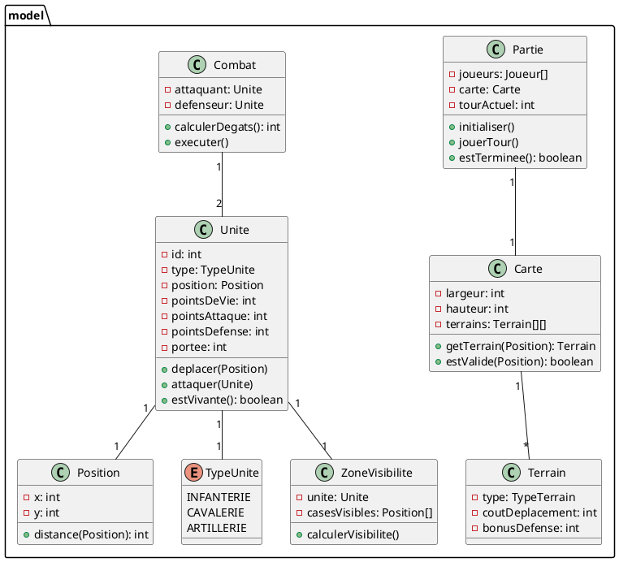
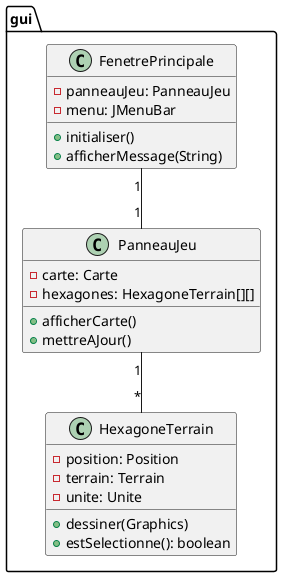
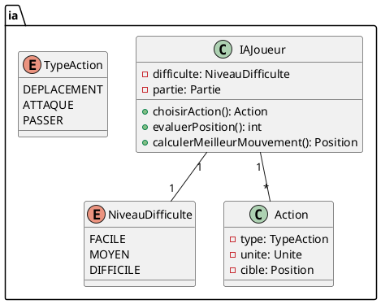
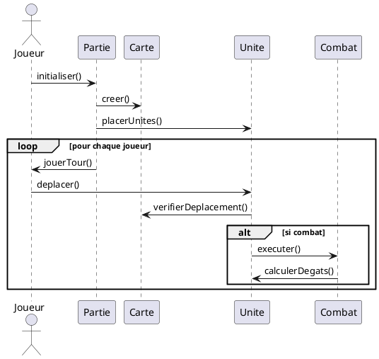
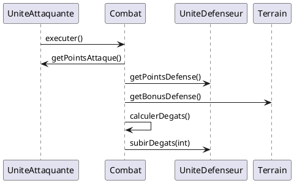
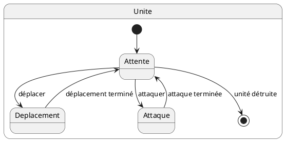
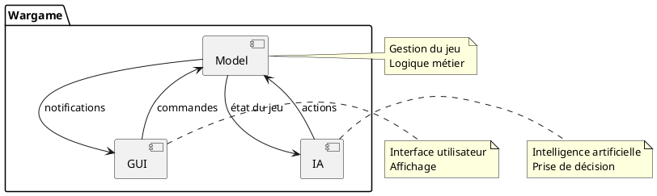
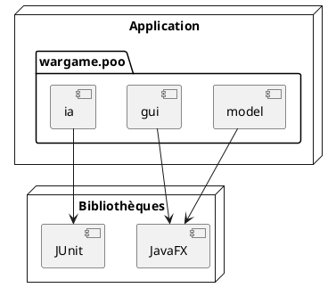

# Structure du Projet Wargame

Ce document présente la structure complète du projet Wargame à travers différents diagrammes UML.

## 1. Diagrammes de Classes

### 1.1 Modèle Principal

**Explication :** Le modèle principal contient les classes fondamentales du jeu. La classe `Unite` représente les unités militaires avec leurs caractéristiques et actions. `Carte` gère le terrain de jeu, tandis que `Partie` orchestre le déroulement du jeu. Les autres classes supportent des fonctionnalités spécifiques comme le combat et la visibilité.

### 1.2 Interface Graphique

**Explication :** L'interface graphique est construite autour de trois classes principales. `FenetrePrincipale` gère la fenêtre principale du jeu, `PanneauJeu` affiche la carte, et `HexagoneTerrain` représente chaque case hexagonale du terrain.

### 1.3 Intelligence Artificielle

**Explication :** Le système d'IA est composé de `IAJoueur` qui prend des décisions basées sur la difficulté choisie. Les actions possibles sont définies par l'enum `TypeAction`.

## 2. Diagrammes de Séquence

### 2.1 Déroulement d'une Partie

**Explication :** Ce diagramme montre le flux principal du jeu, de l'initialisation au déroulement des tours, incluant les déplacements et les combats.

### 2.2 Système de Combat

**Explication :** Le système de combat gère les interactions entre unités, prenant en compte les caractéristiques des unités et les bonus du terrain.

## 3. Diagrammes d'État

### 3.1 États d'une Unité

**Explication :** Une unité peut être dans différents états : en attente, en déplacement, en attaque, ou détruite.

## 4. Diagrammes de Composants

**Explication :** L'architecture du jeu est divisée en trois composants principaux qui interagissent entre eux : le modèle, l'interface graphique et l'IA.

## 5. Diagramme de Déploiement

**Explication :** Le diagramme de déploiement montre l'organisation des packages et leurs dépendances avec les bibliothèques externes. 